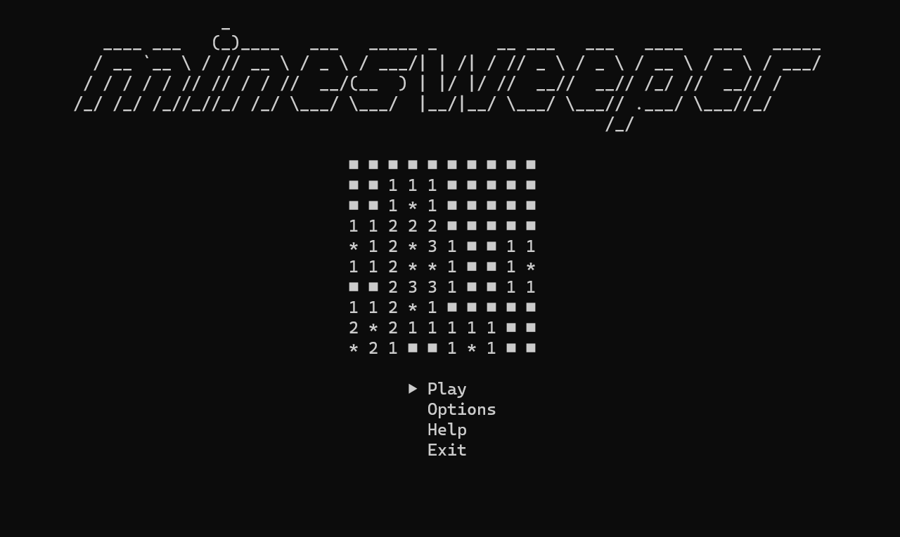

# ASCII Minesweeper
Inspired by a minesweeper game on my graphing calculator, I decided to create a minesweeper game that you can play directly in your terminal. This implementation is written in Python and does use `numpy` under the hood.

## Screenshot

<!--  -->

## Install
```shell
pip install ascii-minesweeper
```

## Run
In order to run the program from the terminal, you can type:
```shell
minesweeper
```

Otherwise, you can also launch the program from another Python script as an Easter egg like this:
```python
from minesweeper.play import PlayMinesweeper
play = PlayMinesweeper()
play.launch_game()
```

## Controls
* Arrow keys or WASD - Moves the cursor
* Space - Mark a square as a flag, question mark, or back to hidden
* Enter - Select a square to uncover
* Backspace or CTRL-C - Returns to main menu
